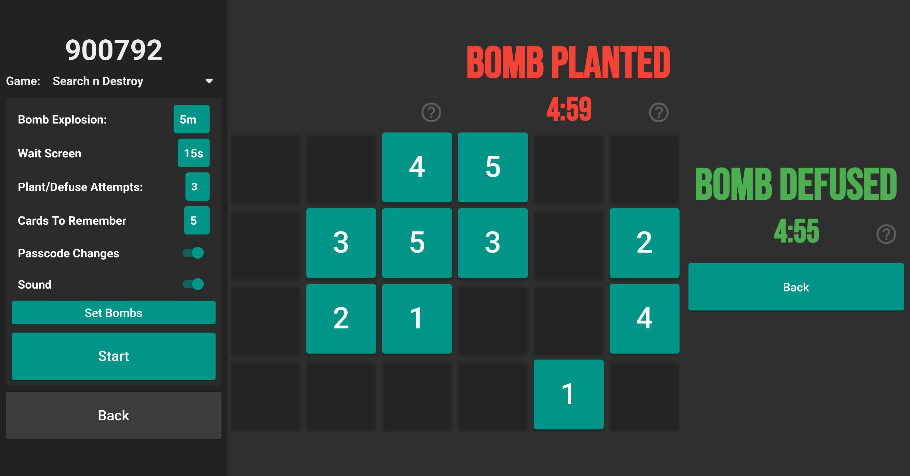

# Nguha - Airsoft/Paintball App (Early Access on Play Store)

Nguha is a powerful mobile application designed for airsoft and paintball enthusiasts. It brings the excitement of common game modes to life, allowing players to experience the thrill of various missions and objectives. This app not only serves as a communication tool but also provides a hub for tracking statistics and engaging in mini-games related to bomb planting and defusing actions.

### Key Features:

- **Realistic Emulation**: Nguha recreates popular airsoft and paintball game modes, turning each bomb or flag into a dynamic element that sends messages and sound effects to players' devices. Get ready to immerse yourself in the action.

- **Team and Player Stats**: Keep track of your team's performance and individual statistics. Nguha provides comprehensive data to help you analyze your gameplay and make strategic decisions.

- **Mini Games**: Engage in small-scale challenges related to bomb planting and defusing. Sharpen your skills and have fun with these exciting side activities.

- **Intuitive Interface**: Nguha's user-friendly interface ensures a smooth experience for both hosting and joining games. You can easily navigate through the app's different sections and settings.

### How it Works:

- **Joining a Game**:
Start by joining a game through the JoinPage.
Input the game code and your preferred settings.
Once joined, you'll receive updates on the game's state and objectives.
Stay informed through text notifications and in-game sound effects.
Enjoy a confirmation dialog for hassle-free game exit.   

- **Hosting a Game**:
Create your game as a host with your chosen display name.
Generate a unique game code for your session.
Customize game settings, including sound options and start conditions.
Invite friends to join and participate in the action.   

- **Search and Destroy Mode**:
Dive into the intense Search and Destroy mode, where every decision matters.
Defuse or plant bombs strategically, using your skills to outsmart your opponents.
Experience thrilling moments, such as bomb explosions and last-minute defusals.
Keep an eye on the timer and play your best to secure victory.

# Nguha Development

## Realtime Database
- games
    - {gamecode}
        - info
        - users
        - gameState

## Process
### Joining Game:
**JoinPage** = *nguha/join/JoinPage.dart*   
**JoinedPage** = *nguha/join/Joined page*   
**GamePage**  = *nguha/games/snd/GamePage page*    
- JoinPage called given no parameters
- JoinPage gets game code input
- JoinedPage Passes game code, sound bool and display name to JoinedPage
- JoinedPage on Initialize
    - Adds user to game
    - Starts listening to
        - Game State Integer
            - On value 
                - updates game state
                - Sets State
        - Start Game Bool
            - On value
                - Gets person team
                - if the team is a bomb
                    - Download info calls Snd GamePage with info
- JoinedPage on Deactivate
    - Removes user from game
    - Deactivates listeners
- JoinedPage On state change
    - Calls getTextPlaySound with game state
        - Returns english text of game state
        - Plays appropriate sound if not muted
- Back Button
    - Shows confirmation dialog

### Hosting Game
**GamePage**  = *nguha/games/snd/GamePage*      
**HostPage**  = *nguha/host/HostPage*    
**SettingPage**  = *nguha/host/SettingPage*  
**PassiveHostPage**  = *nguha/games/snd/PassiveHost*  
- HostPage called with user display name
- Calls SettingPage with display name
- SettingPage on initialize
    - Generates random game code
    - Adds user to game
    - Sets state with user code and game code
- SettingPage on deactivate
    - Deletes game information
- Base widget shows game code, back button and game select dropdown
- if dropdown is snd then shows the SndSettings widget located in same file.
- SndSettings widget contains all settings for search and destroy including game sound and start button.
- If SndSettings widget start button is called, passes information to GamePage
- SndSettings Contains Select Bombs Page Passed game code
    - On initialize 
        - Activates listener on games user list 
                - On change maps names and name ids to maps
    - On Deactivate
        - Removes listeners
    - On state change
        - Iterates through users adding player item for each user
    - Each player item has a dropdown allowing
        - #1 Bomb
        - #2 Bomb
        - -
    - If changes dropdown value
        - if bomb and value is not used, sets players team to a appropriate bomb
        - else if value is used does not set
    - Does not allow to be backed out unless atleast one bomb is set
    - On start button press
        - uploads game information
        - if host is bomb passes info to GamePage
        - if host is not bomb passes to PassiveHostPage
- PassiveHostPage
    - Pops context when gamestate is set to 0

    

### Search and Destroy 
**SelectPage**  = *nguha/games/snd/GamePage*   
**PassiveBombPage**  = *nguha/games/snd/PassiveBomb*   

- Passed Snd game settings, user code and game code
- On initialize 
    - Sets game state to 1006
    - Generates random list for first pass code
    - Starts wait timer if wait is not 0
    - if wait seconds still above 0
        - sets state removing 1 second from varible
    - else cancels wait timer
    - Activates listener for start game bool
        - on value equalling false pass game code to PassiveBombPage
- On deactivate 
    - Sets game state to 0
    - Sets start game bool to false
    - Deactivates listener
- Main widget
    - If wait seconds is not 0 show wait seconds left
    - else show bomb in original state not planted
        - For every input must be one more than the last inputted starting input of 0.
        - if not one more then previous, passcode is incorrect
        - if still has passcode attempts resets code (if code changes bool is true generates new code)
        - else if no code left Explodes bomb (sets state) if in planted state, if in unplanted resets anyway
        - if inputted code is correct order and is highest number
            - if bomb not planted, plants bomb sets game state
            - if bomb is planted, defuses bomb sets game state
        - If bomb planted and time runs out, bomb explodes setting gamestate
    - Setting state plays appropriate sound.
    - after first tile is hit, hides all tiles. if incorrect shows tiles.
    - On plant bomb
        - Sets bombName to the planted bombs user display name
        - deactivates listeners
        - Sets start game bool to false
        - sets curr state to bomb planted

